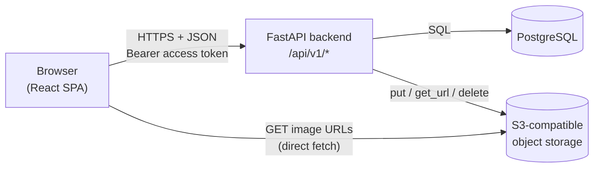
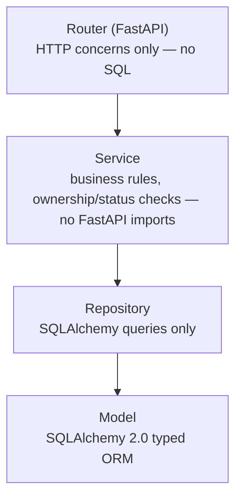
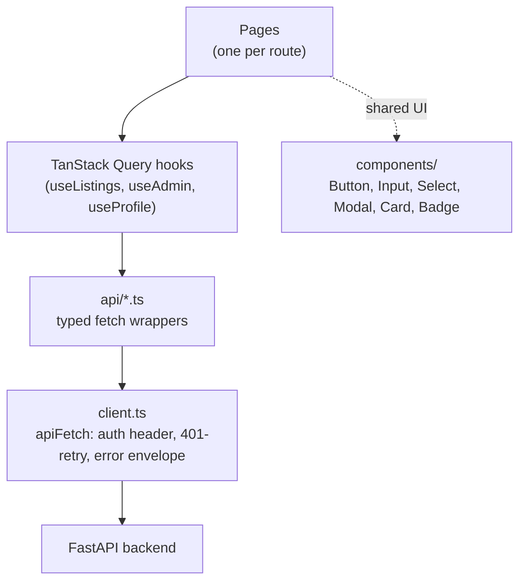
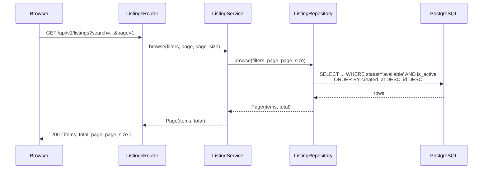
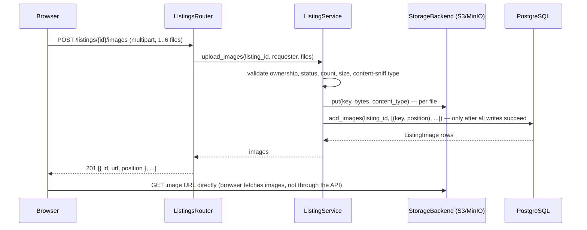
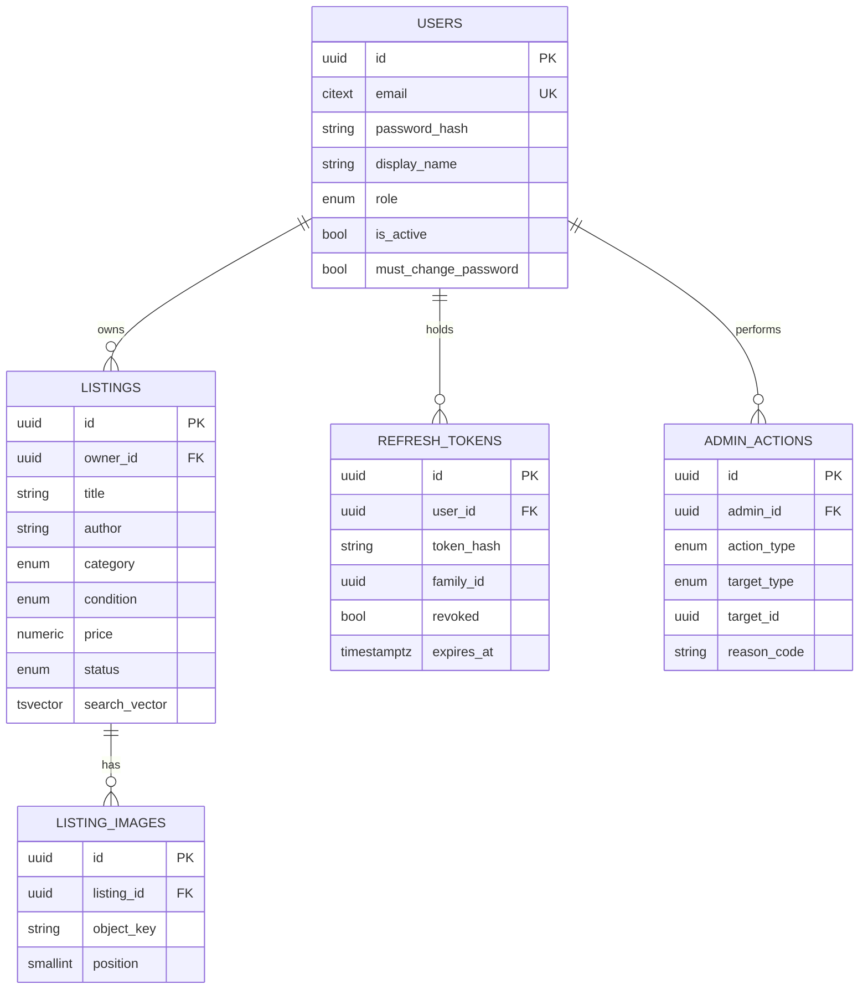

# Punah-Pustak

A peer-to-peer marketplace for buying and selling pre-owned books, rebuilt from the ground up (V2) as a layered, typed, tested full-stack application.

[](https://github.com/Sneha73685/Punah-Pustak/actions/workflows/ci.yml)


> **Status:** Milestones 0–5 of the [SRS](SRS-v2.1.0.md) are complete and frozen (core product: auth, listings, profile, admin, frontend). Milestones 6–7 (accessibility CI gate, end-to-end test suite, production hardening) are **not yet implemented** — see [Roadmap](#roadmap) for exactly what that means.

---

## Table of Contents

- [Punah-Pustak](#punah-pustak)
  - [Table of Contents](#table-of-contents)
  - [Project Overview](#project-overview)
  - [Features](#features)
    - [User Features (any registered account)](#user-features-any-registered-account)
    - [Seller Features (any registered account, acting on their own listings)](#seller-features-any-registered-account-acting-on-their-own-listings)
    - [Administrator Features](#administrator-features)
  - [Technology Stack](#technology-stack)
  - [System Architecture](#system-architecture)
    - [Overall architecture](#overall-architecture)
    - [Backend architecture](#backend-architecture)
    - [Frontend architecture](#frontend-architecture)
    - [Request flow (example: browsing listings)](#request-flow-example-browsing-listings)
    - [Authentication flow](#authentication-flow)
    - [Authorization](#authorization)
    - [Storage flow](#storage-flow)
  - [Repository Structure](#repository-structure)
  - [Database](#database)
  - [API](#api)
  - [Installation](#installation)
  - [Docker](#docker)
  - [Environment Variables](#environment-variables)
  - [Running Tests](#running-tests)
    - [Backend (pytest)](#backend-pytest)
    - [Frontend (Vitest + React Testing Library)](#frontend-vitest--react-testing-library)
    - [End-to-end (Playwright)](#end-to-end-playwright)
    - [Coverage](#coverage)
  - [Security](#security)
  - [Development Workflow](#development-workflow)
  - [Roadmap](#roadmap)
  - [License](#license)
  - [Contributors](#contributors)
  - [Acknowledgements](#acknowledgements)

---

## Project Overview

Punah-Pustak lets individuals list, browse, and discover pre-owned books directly from one another. A seller creates a listing with a title, author, description, condition, category, price, and up to six photos; a buyer browses, searches, and filters; the two arrange the actual exchange **off-platform** (phone, email, in person — whatever they already use). The system's job is discovery and listing management, not payments, shipping, or messaging.

That scope is deliberate, not incomplete. The [Software Requirements Specification](SRS-v2.1.0.md) explicitly excludes payments, in-app chat, shipping integration, notifications, recommendations, and social features (§4, Non-Goals) — each because it would pull the project toward a different, larger product than the one being built. What the SRS *does* ask for is a properly engineered marketplace: real separation of concerns, a correctly modeled relational schema, authentication that isn't an afterthought, automated tests at every layer, and a reproducible, containerized environment a new contributor can stand up in minutes.

V2 is a full re-architecture of an earlier prototype. The product concept didn't change; how it's built did — see [`IMPLEMENTATION_SUMMARY.md`](IMPLEMENTATION_SUMMARY.md) for the complete, milestone-by-milestone decision log behind every non-obvious engineering choice in this repository.

## Features

### User Features (any registered account)
- Register and log in; a session survives a page reload via a rotating refresh token.
- Browse, full-text search, and filter listings by category, condition, and price range, with pagination.
- View a listing's full detail page (images, description, price, condition, seller display name).
- View and edit your own display name; change your own password.
- View a summary of your own listings' counts by status (available / sold / deleted).

There is no separate "buyer" role — every account can act as both buyer and seller, matching the peer-to-peer nature of the product. What differs between users is never a role, only *which listings a given user is permitted to mutate* (ownership).

### Seller Features (any registered account, acting on their own listings)
- Create a listing with 1–6 images (JPEG/PNG/WebP, validated by content, not just file extension).
- Edit a listing — only while it's still `available`.
- Mark a listing as sold.
- Delete a listing (soft delete — it disappears from public browse but the seller can still see it).
- View "My Listings": every listing you own, in every status, including ones buyers can no longer see.

### Administrator Features
- List every user account with basic metadata and status.
- Suspend or reinstate a user account (a suspended user is immediately blocked from logging in again or refreshing their session; their listings disappear from public browse).
- Trigger an admin-assisted password reset for a locked-out user, returning a one-time temporary password.
- List and remove (soft-delete) **any** listing, in any status, with a required reason code.
- Every moderation action is written to an append-only audit log.

Administration here is moderation only — there are deliberately no analytics dashboards, revenue reports, or usage graphs (SRS §4/FR-044).

## Technology Stack

| Layer | Choice | Why |
|---|---|---|
| **Backend** | Python 3.12, FastAPI, SQLAlchemy 2.0 (typed `Mapped[...]`), Alembic, Pydantic v2 | A layered, fully-typed API framework with first-class dependency injection and OpenAPI generation for free. |
| **Frontend** | React 18, TypeScript (strict), Vite 8, React Router v7, TanStack Query v5, Tailwind CSS v4 | A typed SPA with server state owned entirely by TanStack Query — no Redux/Zustand duplicating it. |
| **Database** | PostgreSQL 16 | Native `citext` (case-insensitive email), `tsvector` full-text search, and enum types — no second search service, no ORM workaround. |
| **Storage** | S3-compatible object storage (MinIO locally, AWS S3 or equivalent in production) behind a small `StorageBackend` interface | Images never touch the database; the interface swaps to a fake in tests. |
| **Authentication** | Short-lived JWT access tokens (HS256) + opaque, rotating, revocable refresh tokens | See [`docs/authentication.md`](docs/authentication.md) for the full model. |
| **Testing** | pytest + pytest-cov + pytest-randomly (backend); Vitest + React Testing Library (frontend) | See [Running Tests](#running-tests) and [`docs/testing.md`](docs/testing.md) — including an honest account of what is *not* yet covered. |
| **CI/CD** | GitHub Actions (lint, type-check, tests, build, coverage gate on every PR) | See [`.github/workflows/ci.yml`](.github/workflows/ci.yml). No CD/deploy pipeline exists yet — see [Roadmap](#roadmap). |
| **Developer tooling** | Ruff (lint + format), mypy `--strict`, pre-commit hooks, `openapi-typescript` (generates frontend types from the live backend schema — no hand-duplicated API types) | Zero-config drift between backend and frontend type contracts. |

## System Architecture

### Overall architecture

Four pieces, no more: a REST API, a single-page frontend, a relational database, and object storage. No message queue, no cache layer, no second search service, no microservices — the [SRS's own "deliberate simplicity log"](SRS-v2.1.0.md#appendix-a-deliberate-simplicity-log) records exactly what was considered and rejected, and why (a modular monolith at this scale outperforms microservices on every axis that matters: it's simpler to reason about, faster to build correctly, and has no distributed-systems tax to pay for a domain this size and traffic).



### Backend architecture

The backend is a **modular monolith**: one deployable process, organized into modules (`auth`, `users`, `listings`, `admin`, `storage`) that each own their own routers, services, and repositories, plus a framework-agnostic `core` (config, DB session, error handling, logging, rate limiting). Every module is layered identically:



A router never runs a database query, and a service never constructs an HTTP response — every failure is a plain Python `DomainError` subclass, translated into the API's standard error envelope by one central handler. Cross-module calls go through a module's *service* (its public interface), never another module's repository directly — e.g. `AdminService` orchestrates `UserService`, `ListingService`, and `AuthService` together for a suspension, but never touches `UserRepository` itself. Full detail: [`docs/backend.md`](docs/backend.md).

### Frontend architecture



Every server-state read or write goes through a TanStack Query hook — no component calls `fetch` or an `api/*.ts` function directly, and there is no separate Redux/Zustand store duplicating server data. `AuthContext` holds the current session (loading / unauthenticated / password-change-required / authenticated) and is the one place login, logout, and token refresh state live. Full detail: [`docs/frontend.md`](docs/frontend.md).

### Request flow (example: browsing listings)



### Authentication flow

```mermaid
sequenceDiagram
    participant U as Browser
    participant A as Auth endpoints
    participant DB as PostgreSQL

    U->>A: POST /auth/login {email, password}
    A->>DB: verify password hash (Argon2id), check is_active
    A-->>U: 200 { access_token } + Set-Cookie refresh_token (HttpOnly, SameSite=Strict)
    Note over U: access_token kept in memory only, never localStorage

    U->>A: (15 min later) any request → 401
    U->>A: POST /auth/refresh (cookie sent automatically)
    A->>DB: look up hash of presented token, verify not revoked/expired
    A->>DB: mark old token revoked; insert new token (same family)
    A-->>U: 200 { access_token } + Set-Cookie new refresh_token
```

Refresh tokens rotate on every use. Presenting an already-rotated (revoked) token is treated as evidence of theft and revokes every token in that login's family, forcing a full re-login. Full detail: [`docs/authentication.md`](docs/authentication.md).

### Authorization

Every mutating endpoint re-derives the caller's identity from the verified access token (never a client-supplied ID) and performs an explicit ownership or role check in the *service* layer — a listing edit checks `listing.owner_id == requester.id`; every `/api/v1/admin/*` endpoint depends on a `require_admin` gate that checks `role == "admin"` from the freshly-loaded database row, never from a token claim or request field.

### Storage flow



If a storage write fails partway through a batch, whatever was already written is best-effort deleted and the database is never touched — an image upload either fully succeeds or leaves no trace, never a partial/orphaned state.

## Repository Structure

```
Punah-Pustak/
├── backend/                 FastAPI application
│   ├── app/
│   │   ├── core/             config, DB session, error envelope, logging, rate limiter
│   │   ├── api/v1/            health check + versioned router aggregation
│   │   └── modules/
│   │       ├── auth/          register, login, refresh, logout, JWT + refresh-token logic
│   │       ├── users/         own-profile view/edit, password change
│   │       ├── listings/      browse/search/filter, CRUD, image upload
│   │       ├── admin/         user/listing moderation, audit log
│   │       └── storage/       StorageBackend interface + S3 implementation
│   ├── alembic/                 schema migrations (one, hand-written: 0001_initial_schema)
│   ├── tests/                   pytest: unit, integration, API-level
│   ├── docker-entrypoint.sh      applies migrations, then execs the app — every environment
│   └── pyproject.toml            dependencies, Ruff/mypy/pytest config
├── frontend/                 React + TypeScript SPA
│   ├── src/
│   │   ├── api/                generated OpenAPI types + typed fetch wrappers per resource
│   │   ├── auth/                AuthContext, ProtectedRoute
│   │   ├── components/           shared UI library + cross-page components
│   │   ├── hooks/                 TanStack Query hooks (one file per resource)
│   │   ├── lib/                    small framework-agnostic helpers
│   │   └── pages/                  one file per route, plus pages/admin/
│   └── vercel.json              Vercel build config + SPA rewrite (production frontend hosting)
├── docs/                      in-depth documentation (see below)
├── SRS-v2.1.0.md              the governing requirements specification
├── IMPLEMENTATION_SUMMARY.md   the full engineering decision log, by milestone
├── render.yaml                 Render Blueprint for the API + managed Postgres (production backend hosting)
└── docker-compose.yml          the entire local stack: db, storage, storage-init, api, web
```

Deeper documentation lives in [`docs/`](docs/):

| Document | Covers |
|---|---|
| [`docs/architecture.md`](docs/architecture.md) | Full architectural rationale, module boundaries, layering rules |
| [`docs/backend.md`](docs/backend.md) | Every backend module, in detail |
| [`docs/frontend.md`](docs/frontend.md) | Routing, state management, component library, API client |
| [`docs/database.md`](docs/database.md) | Full ERD, every table/column, indexes, migration strategy |
| [`docs/authentication.md`](docs/authentication.md) | JWT/refresh-token lifecycle, password hashing, suspension semantics |
| [`docs/api.md`](docs/api.md) | Full endpoint reference, error envelope, pagination |
| [`docs/deployment.md`](docs/deployment.md) | Local Docker Compose, the exact production deployment process (Vercel/Render/Postgres/S3), what's not yet built |
| [`docs/testing.md`](docs/testing.md) | Test suite structure, coverage, and an honest gap analysis |
| [`docs/development.md`](docs/development.md) | Day-to-day contributor workflow |
| [`docs/contributing.md`](docs/contributing.md) | How to propose and land a change |

## Database

PostgreSQL 16, five tables, one hand-written migration. Full detail (every column, every index, every constraint) in [`docs/database.md`](docs/database.md).



## API

REST over JSON, versioned under `/api/v1/`. Every error response — including ones FastAPI/Pydantic generate automatically — is translated into one consistent envelope:

```json
{ "error": { "code": "VALIDATION_ERROR", "message": "Request validation failed.", "fields": { "price": ["..."] } } }
```

List endpoints use offset pagination (`page`, `page_size`, capped at 50), returning `{ items, total, page, page_size }`. The interactive OpenAPI docs are served by the running backend at `/docs`; a full endpoint-by-endpoint reference (auth requirements, request/response shapes) lives in [`docs/api.md`](docs/api.md).

## Installation

From a completely fresh clone, with **Docker and Docker Compose** as the only prerequisite:

```bash
git clone <(https://github.com/Sneha73685/Punah-Pustak)>
cd Punah-Pustak
docker compose up
```

That's it — the `api` container's entrypoint ([`backend/docker-entrypoint.sh`](backend/docker-entrypoint.sh)) applies the database schema automatically (`alembic upgrade head`) before the API starts, on every boot, so there's no separate migration command to remember on a fresh clone or after pulling a future migration.

Open the app:
- Frontend: <http://localhost:5173>
- API + interactive docs: <http://localhost:8000/docs>
- Health check: <http://localhost:8000/api/v1/health>

That's the entire setup — no manual database creation, no manual bucket setup (the `storage-init` service provisions it automatically), no separate service accounts to configure.

## Docker

`docker-compose.yml` defines five services:

| Service | Image / build | Purpose |
|---|---|---|
| `db` | `postgres:16` | The database. Persists to a named volume. |
| `storage` | `minio/minio` | S3-compatible object storage for listing images. |
| `storage-init` | `minio/mc` | One-shot: creates the bucket and sets it public-readable, then exits. |
| `api` | `backend/Dockerfile` | FastAPI, live-reloading against a bind-mounted `backend/app`. Its entrypoint ([`backend/docker-entrypoint.sh`](backend/docker-entrypoint.sh)) applies migrations before every start — see [`docs/deployment.md`](docs/deployment.md#automatic-migrations-on-startup). |
| `web` | `frontend/Dockerfile` | Vite dev server, live-reloading against a bind-mounted `frontend/src`. |

Rebuilding after a dependency change (not just a source-file change, which hot-reloads automatically):

```bash
docker compose build api   # after editing backend/pyproject.toml
docker compose build web   # after editing frontend/package.json
```

The exact production deployment process (Vercel for the frontend, Render for the API, managed Postgres, S3-compatible storage) and what this repository still doesn't include (a staging environment, an automated CD pipeline) are both in [`docs/deployment.md`](docs/deployment.md).

## Environment Variables

Backend configuration is a single typed `Settings` object (`backend/app/core/config.py`), loaded from environment variables — see [`backend/.env.example`](backend/.env.example) for the local-development template. `docker-compose.yml`'s `api` service sets working defaults for every one of these already; you only need your own `.env` for running the backend **outside** Docker.

| Variable | Default (local) | Purpose |
|---|---|---|
| `ENVIRONMENT` | `local` | `local` / `test` / `production`. Drives log format and cookie `Secure` flag defaults. |
| `DATABASE_URL` | `postgresql+psycopg://punah:punah@db:5432/punah_pustak` | SQLAlchemy connection string (psycopg3 driver). |
| `JWT_SECRET` | *(insecure placeholder — see below)* | HS256 signing secret for access tokens. **Must** be overridden with a random ≥32-byte secret in production; the app refuses to start otherwise. |
| `ACCESS_TOKEN_TTL_MINUTES` | `15` | Access token lifetime. |
| `REFRESH_TOKEN_TTL_DAYS` | `30` | Refresh token lifetime. |
| `AUTH_RATE_LIMIT_PER_MINUTE` | `10` | Per-IP limit on `/auth/login`, `/auth/register`, `/auth/refresh`. |
| `CORS_ALLOWED_ORIGINS` | `http://localhost:5173` | Comma-separated exact origins — **never** a wildcard (the app refuses a `*` value at startup). |
| `STORAGE_ENDPOINT_URL` | `http://storage:9000` | Where the **API container** reaches the object store (internal Docker network). |
| `STORAGE_PUBLIC_URL` | `http://localhost:9000` | Base URL the **browser** uses to fetch images — deliberately a different value than the endpoint URL above. |
| `STORAGE_BUCKET` | `punah-pustak-listing-images` | Bucket name. |
| `STORAGE_ACCESS_KEY` / `STORAGE_SECRET_KEY` | local MinIO credentials | Object storage credentials. |
| `COOKIE_SECURE` | `false` | Refresh-token cookie's `Secure` flag. **Must** be `true` in any deployed environment; the app refuses to start with `ENVIRONMENT=production` and this set to `false`. |
| `LOG_LEVEL` | `INFO` | Root logger level. |

The frontend has exactly one optional variable — see [`frontend/.env.example`](frontend/.env.example):

| Variable | Default | Purpose |
|---|---|---|
| `VITE_API_BASE_URL` | `http://localhost:8000` | The browser-reachable origin of the API. Only needed if the API isn't at the default local port. |

## Running Tests

### Backend (pytest)

```bash
cd backend
pip install -e ".[dev]"
ruff check . && ruff format --check . && mypy app alembic tests
pytest
```

292 tests (unit, integration against a real containerized Postgres, and API-level via FastAPI's `TestClient`), **99% overall coverage**, **100%** on every `service`/`repository` module. Integration tests run inside a rolled-back transaction per test and are re-run in randomized order in CI to catch order-dependent bugs.

### Frontend (Vitest + React Testing Library)

```bash
cd frontend
npm ci
npx tsc --noEmit
npm run test
```

25 component/integration tests across 7 files, covering the shared form components, the modal focus trap, loading/error/empty states, and — the one the SRS specifically calls out — the forced-password-change redirect.

### End-to-end (Playwright)

**Not implemented.** The SRS (§18.2, Milestone 7) calls for a Playwright suite covering three critical paths (seller lifecycle, admin moderation, account recovery). This repository does not yet contain one — see [Roadmap](#roadmap). Every one of those flows *was* manually verified against the live Docker Compose stack during development (see `IMPLEMENTATION_SUMMARY.md`'s Milestone 5 audit sections for specifics), but that verification is not automated or repeatable from a checked-in test file today.

### Coverage

Backend coverage is enforced in CI at 85% minimum on `services`/`repositories` (currently at 100%); see the `backend-tests` job in [`.github/workflows/ci.yml`](.github/workflows/ci.yml). Frontend coverage can be generated locally with `npm run test:coverage` but is not currently CI-gated.

## Security

Full detail and the reasoning behind each choice: [`docs/authentication.md`](docs/authentication.md) and [SRS §15](SRS-v2.1.0.md#15-security-requirements).

- **Password hashing** — Argon2id (never bcrypt-only, never a fast general-purpose hash), for both user-chosen and admin-generated temporary passwords.
- **JWT access tokens** — short-lived (15 min), HS256, held in memory on the frontend only (never `localStorage`).
- **Refresh tokens** — opaque random strings (never JWTs), stored server-side only as a salted hash, rotated on every use. Presenting an already-rotated token revokes the entire token family (theft/reuse detection).
- **Role-based access control** — `user` / `admin`, re-checked from the database on every request via a `require_admin` dependency; never trusted from a client-supplied field or a token claim.
- **Validation** — every request body is a Pydantic v2 model; business-rule validation (e.g. "email already registered") raises the same structured error envelope as schema validation.
- **Rate limiting** — a per-IP, in-memory limiter on `/auth/login`, `/auth/register`, and `/auth/refresh` (10 requests/minute by default).
- **Storage security** — uploaded files are validated by actual byte content (magic-number sniffing), not filename or declared `Content-Type`; storage keys are server-generated UUIDs, never derived from user input.
- **CORS** — exact-origin allowlist only; the app refuses to start with a wildcard origin configured.

## Development Workflow

1. Bring up the stack: `docker compose up`. Migrations apply automatically on container start — no separate step.
2. Backend changes hot-reload via the bind-mounted `backend/app`; frontend changes hot-reload via Vite. No rebuild needed for source edits — only for dependency changes (see [Docker](#docker)).
3. Before committing, run the same checks CI runs (`pre-commit install` wires the backend ones — Ruff, Ruff format, mypy strict — to run automatically on `git commit`; run the frontend and test suites manually).
4. Open a PR against `main`. CI must be green (lint, type-check, backend tests + coverage gate, frontend tests + build) before it's mergeable.

Full detail, including branch naming and commit-message conventions: [`docs/development.md`](docs/development.md) and [`docs/contributing.md`](docs/contributing.md).

## Roadmap

The SRS defines eight milestones (0 through 7). **Milestones 0–5 are complete**: foundations, authentication, listings, profile management, administration, and the full frontend. The following are explicitly **not yet built** — not partially done, not silently skipped, genuinely not started:

- **Milestone 6 — Accessibility polish**: an automated `axe-core` accessibility regression gate in CI. The component library already implements the underlying mechanics (label association, modal focus trapping, keyboard operability) but there is no automated check enforcing WCAG 2.1 AA compliance yet.
- **Milestone 7 — Hardening and release readiness**: a committed Playwright end-to-end test suite; a one-time load test against the NFR-001 performance target; CSRF/security-header verification as an automated (not just manual) check. (The production deployment process itself — Vercel, Render, managed Postgres, S3-compatible storage — is documented and configured; see [`docs/deployment.md`](docs/deployment.md).)

Beyond the SRS's own plan, explicitly out of scope for *any* future milestone unless a new SRS revision says otherwise (see [SRS §4, Non-Goals](SRS-v2.1.0.md#4-non-goals)): payments/escrow, in-app messaging, shipping integration, push/email notifications, recommendations, and social features.

## License

[MIT](LICENSE).

## Contributors

- **Sneha** — sole author and maintainer to date.

Contributions are welcome — see [`CONTRIBUTING.md`](CONTRIBUTING.md).

## Acknowledgements

Built with [FastAPI](https://fastapi.tiangolo.com/), [SQLAlchemy](https://www.sqlalchemy.org/), [React](https://react.dev/), [TanStack Query](https://tanstack.com/query), and [Tailwind CSS](https://tailwindcss.com/) — and the PostgreSQL and MinIO projects for making a fully self-hostable, zero-paid-dependency local stack possible.
