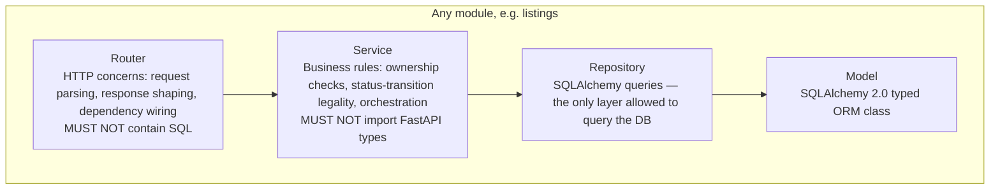
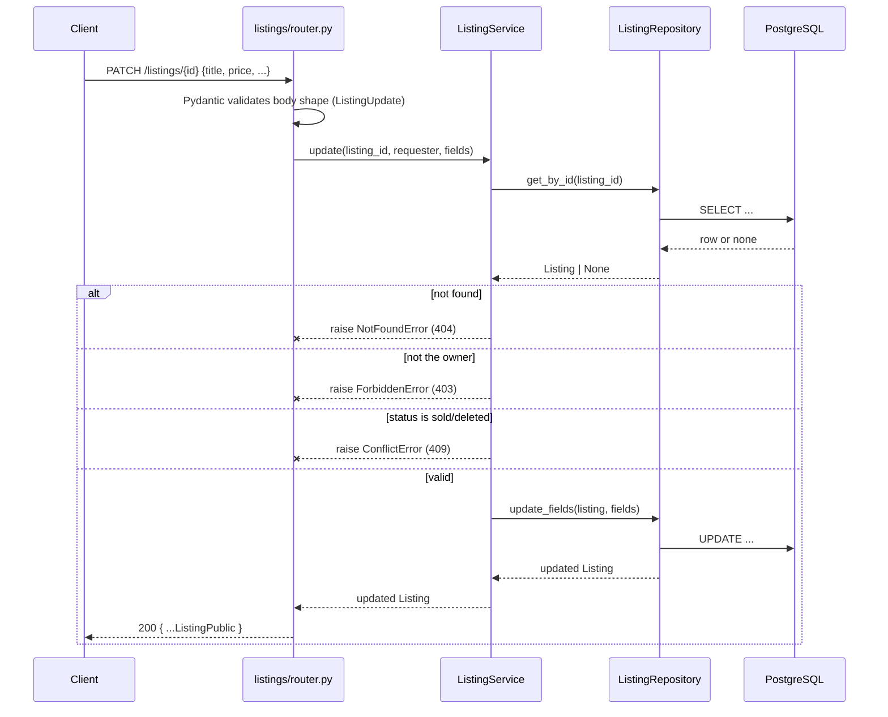

# Architecture

This document explains *why* the system is shaped the way it is, not just what the pieces are. For a module-by-module tour of the backend code, see [`backend.md`](backend.md); for the frontend, see [`frontend.md`](frontend.md).

## Guiding constraint: target scale

Every architectural decision in this codebase is made against one explicit assumption ([SRS §17.1](../SRS-v2.1.0.md#171-expected-load-baseline)): a portfolio-scale marketplace — a few hundred users, low thousands of listings, tens of concurrent sessions at peak, and **exactly one running application instance**. This is not a limitation that was discovered later; it's a starting premise. Every "why didn't you use X" question in this document has the same first answer: *X would be justified at a scale this product doesn't target.*

## Why a modular monolith, not microservices

One deployable backend process, internally divided into modules (`auth`, `users`, `listings`, `admin`, `storage`) that each own their own routers, services, and repositories. Microservices would require inter-service authentication, network resilience handling, and either distributed transactions or eventual consistency — for one small, cohesive domain backed by one database. That's operational complexity with no corresponding benefit at this scale: no independent scaling needs exist, no separate team boundaries exist to justify separately deployable services. A well-modularized monolith gets the same separation-of-concerns discipline (each module's business logic is independently testable and independently reasoned about) without the distributed-systems tax.

The module boundary is enforced socially and structurally, not by network calls: module A calls into module B's **service** (its public interface) — never module B's repository or ORM model directly. `AdminService`, for example, orchestrates `UserService`, `ListingService`, and `AuthService` together to implement "suspend a user" (flip `is_active`, revoke every refresh token, write an audit record) without ever importing `UserRepository` itself. If this system ever needed to split into real services, module boundaries already point at exactly where the seams would go — but that split is not being pre-built for a need that doesn't exist yet.

## Why strict layering (router → service → repository → model)

This is the single highest-leverage decision in the backend. Two concrete consequences:

1. **Business logic is testable without HTTP.** A service takes its collaborators (repositories, other services) as constructor arguments typed as `Protocol`s, not concrete classes — a unit test hands it a hand-written in-memory fake satisfying the same narrow interface, with no database and no FastAPI `TestClient` involved. Every service in this codebase has a corresponding unit-test file exercising it exactly this way.
2. **Failures are a plain Python vocabulary, translated once.** A service never constructs an HTTP status code or response body — it raises a `DomainError` subclass (`NotFoundError`, `ForbiddenError`, `ConflictError`, `ValidationFailedError`, ...), and one central FastAPI exception handler (`app/core/errors.py`) translates every one of them — plus every error FastAPI/Pydantic raise on their own, like a malformed request body — into the same JSON envelope. No router anywhere in this codebase contains a `try`/`except`.

## Request flow, traced end to end

Using `PATCH /api/v1/listings/{id}` (edit a listing) as a concrete example:

Every one of the four outcomes on the right is a `DomainError` subclass raised from the same `ListingService.update` method — the router itself has no branching logic for any of them; it calls the service once and either gets a value back or an exception propagates to the one global handler.

## Cross-cutting concerns, and where each one lives

| Concern | Lives in | Why there |
|---|---|---|
| Configuration | `app/core/config.py` — one typed `Settings` object | BE-020: no scattered `os.environ.get` calls anywhere else in the codebase. |
| Error envelope | `app/core/errors.py` | One global handler translates every error shape (framework-raised, domain-raised, or truly unhandled) into the same JSON shape — implemented once, not per-router. |
| Structured logging | `app/core/logging.py` | JSON in any deployed environment, human-readable locally — driven by the same `Settings` object, not a hardcoded branch. |
| Rate limiting | `app/core/rate_limit.py` (framework-agnostic limiter) + `app/modules/auth/dependencies.py` (the FastAPI-facing wrapper that reads the client IP) | The limiter itself has no FastAPI import, matching `core`'s "framework-agnostic except `errors.py`" rule; only the HTTP-specific "read the IP off the request" piece lives in a module. |
| Current-user resolution | `app/modules/auth/dependencies.py`'s `get_current_user` | The one choke point every other module depends on for "who is calling" — this is also where the forced-password-change gate (FR-015) is enforced globally, with zero changes needed in any other router. |
| Object storage | `app/modules/storage/backend.py` (a `Protocol`) + `s3_backend.py` (the only implementation) | The service layer never imports `boto3` directly; tests can substitute an in-memory fake. |

## Database choice and search

PostgreSQL 16, chosen over MySQL/SQLite specifically for three built-in capabilities this project relies on directly: `citext` (case-insensitive, collation-aware unique email — eliminates an entire class of case-sensitivity bugs at the type level, not through application code), native `tsvector`/`GIN` full-text search (see below), and solid native `enum`/`numeric` types. SQLite is explicitly unsuitable beyond a developer's own throwaway sandbox — it lacks the concurrent-write robustness this system needs even at its modest target scale.

Full-text search over listing title/author uses a Postgres **generated column** (`search_vector`, computed by Postgres itself on every insert/update) plus a GIN index — not Elasticsearch or OpenSearch. Standing up a second search service is unjustified operational overhead at this scale: native FTS gives adequate relevance ranking with zero additional infrastructure to deploy, secure, or keep in sync. If search sophistication or volume ever outgrows this, the migration path is bounded and isolated, because every query already goes through `ListingRepository` — no code outside that one class knows how search is implemented.

## What was deliberately not built (and why)

The SRS keeps a running list of "obvious-looking" additions that were considered and rejected — kept explicit so a future contributor doesn't reintroduce them without the context ([full list](../SRS-v2.1.0.md#appendix-a-deliberate-simplicity-log)). The recurring pattern: every one of these is the *architecturally sophisticated-looking* choice that would actually make the system harder to build correctly and reason about, for a scale and problem that don't need it.

| Not built | Why |
|---|---|
| Microservices | No independent scaling or team boundaries to justify the split. |
| Elasticsearch / OpenSearch | Postgres FTS is sufficient at target scale. |
| Redis / cache layer | No demonstrated read-heavy bottleneck; `ListingRepository` already isolates data access if one is ever found. |
| GraphQL | REST fits a small, well-known set of resources with no complex client-driven query shaping needs. |
| Kubernetes | Docker Compose is the stated operational ceiling for this project. |
| Asymmetric JWT signing (RS256) | Exactly one service issues *and* verifies tokens — RS256 would be signing-key infrastructure with no second consumer. |
| Redis-backed / distributed rate limiting | The in-memory limiter matches the single-instance deployment target; revisit together if that target ever changes. |

## Related documents

- [`backend.md`](backend.md) — every backend module in detail
- [`frontend.md`](frontend.md) — routing, state management, component structure
- [`database.md`](database.md) — full schema, ERD, indexes
- [`authentication.md`](authentication.md) — the token lifecycle in full
- [`api.md`](api.md) — the complete endpoint reference
