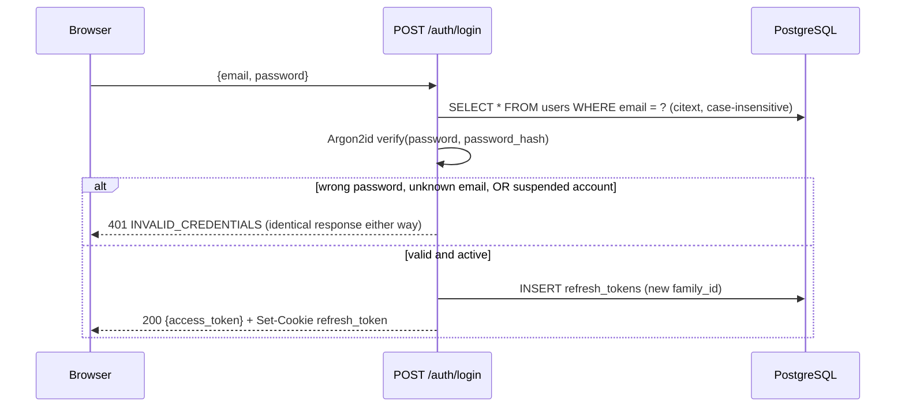
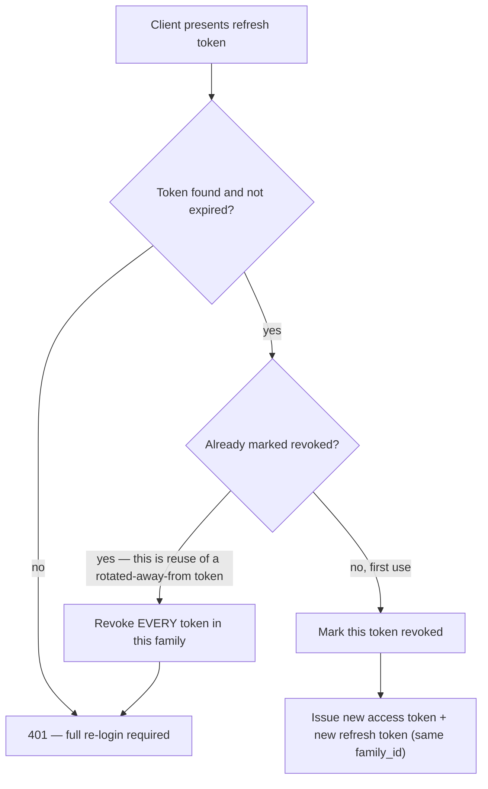
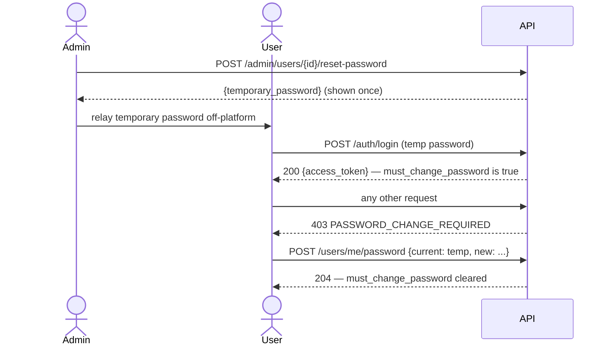

# Authentication

The full token lifecycle, password handling, and account-recovery model. Governing requirements: [SRS §15](../SRS-v2.1.0.md#15-security-requirements) and §7.2/§7.5.

## Two token types, deliberately different in kind

| | Access token | Refresh token |
|---|---|---|
| **Format** | JWT (HS256) | Opaque, cryptographically random string (`secrets.token_urlsafe(32)`) — **never** a JWT |
| **Lifetime** | 15 minutes | 30 days |
| **Where stored (client)** | In memory only (`src/api/tokenStore.ts`), never `localStorage` | `HttpOnly`, `Secure`, `SameSite=Strict` cookie, scoped to `/api/v1/auth` |
| **Where stored (server)** | Nowhere — stateless, verified by signature alone | `refresh_tokens` table, as a salted hash — the plaintext token is never persisted |
| **Revocable before expiry?** | **No** — this is the accepted trade-off; see "Suspension" below | **Yes** — a database row can be marked `revoked` at any time |

A JWT can't be revoked before its own expiry without adding a server-side allowlist/denylist check on every request — which reintroduces exactly the statefulness JWTs exist to avoid. Keeping the access-token lifetime short (15 minutes) is what bounds the blast radius of that trade-off. The refresh token, by contrast, is opaque specifically *so that* it can be revoked: a stateless refresh JWT would make logout and suspension unenforceable before its own expiry, which isn't an acceptable trade-off for either of those.

## Why the access token lives in memory, not `localStorage`

`localStorage` is readable by any script running on the page — including an injected one, in an XSS scenario. An `HttpOnly` cookie is not readable by JavaScript at all. The access token can't use an `HttpOnly` cookie either, though, because the frontend needs to read it to set the `Authorization` header — so it lives in a plain in-memory variable instead (`src/api/tokenStore.ts`), which is inaccessible to a script running in a *different* origin and is wiped by a full page reload (by design — that's what the refresh cookie is for). The refresh token, which never needs to be read by frontend JavaScript at all, goes in the `HttpOnly` cookie instead. The trade-off this introduces (CSRF exposure on the cookie) is mitigated by `SameSite=Strict` plus the same-registrable-domain deployment requirement below — not a separate CSRF-token scheme, which would be more machinery than this same-origin SPA needs.

## Login

A wrong password, an unknown email, and a suspended account all return the **identical** `401 INVALID_CREDENTIALS` response. This is deliberate: telling an anonymous caller "this account exists and is suspended" leaks account-existence information the generic error exists specifically to withhold — a legitimately suspended user already learns why through the same off-platform channel this product uses for every other human-mediated interaction.

## Refresh: rotation and reuse detection

Every successful `POST /auth/refresh` does three things atomically: marks the presented token `revoked`, issues a brand-new refresh token in the **same** `family_id`, and issues a new access token. The client's cookie is replaced on every refresh.

Why this matters: a legitimate client only ever presents its *most recent* refresh token — it rotated away from every earlier one already. If a *revoked* token is ever presented, the only way that can happen is if someone else got hold of an old cookie (e.g. stolen from a backup, a proxy log, a compromised browser profile) and used it after the legitimate client already moved on. Treating that as theft and revoking the whole family forces both the attacker and the legitimate user back to a full login — the standard rotation-with-reuse-detection pattern, and the reason `family_id` exists as its own column rather than just `user_id`.

`AuthService.refresh` reads the presented token via a row lock (`RefreshTokenRepository.get_by_hash_for_update`) specifically so two requests presenting the *same* token at nearly the same instant can't both observe it as not-yet-revoked and both rotate it — verified live during the v2.0.0 release audit: without the lock, firing several concurrent `/auth/refresh` calls with one cookie let multiple of them succeed, each minting a token from what should be a single linear chain. The lock makes the outcome deterministic — exactly one concurrent presentation of a given token can ever win — but doesn't fully close the underlying race: the *losing* request(s), once unblocked, correctly see the token as `revoked` and run the reuse-detection branch above, which revokes the whole family, including the token the *winner* just received a moment earlier. A real multi-tab session restoring at the same instant (both tabs calling `/auth/refresh` on mount, per [`frontend.md`](frontend.md)'s "shared in-flight refresh lock" note — which only covers concurrency *within* one tab, not across tabs) can therefore still be forced into a full re-login. Closing that fully would need a short, time-boxed grace period on the reuse check (the standard mitigation real-world OAuth providers use for this exact race) — a behavior change to the reuse-detection model, not a bugfix, so it's recorded here as a known, accepted limitation rather than made speculatively.

## Suspension: bounded-immediate, not instantaneous

Suspending a user immediately revokes **every** `refresh_tokens` row belonging to them — no further refresh or re-login succeeds from that moment on. However, an access token issued *before* suspension is a stateless JWT and remains technically valid until its own expiry — **at most 15 minutes**. This is an explicit, accepted trade-off, not an oversight: true instantaneous revocation would require checking every access token against a database allowlist/denylist on every single request, which is the exact statefulness this token design exists to avoid, for a bound (≤15 minutes) that's genuinely acceptable at this product's risk profile (a used-book marketplace, not a system handling live financial sessions).

## Password handling

- **Hashing:** Argon2id via `argon2-cffi` — applies identically to user-chosen passwords and admin-generated temporary passwords.
- **Policy:** 10+ characters, no composition rules (no forced uppercase/symbol/digit). Length is the meaningful factor; composition requirements are outdated guidance that pushes users toward predictable, guessable patterns.
- **Admin-generated temporary passwords** (see below) use `secrets.token_urlsafe(16)` — comfortably longer than the minimum, since no human ever has to choose or remember one.

## Forced password change

If an admin triggers a password reset for a locked-out user (`POST /admin/users/{id}/reset-password`), the response returns a one-time temporary password (shown to the admin exactly once, never logged, never emailed) and sets `must_change_password = true` on the target account. From that point, **every** authenticated endpoint except the password-change endpoint itself rejects the account with `403 PASSWORD_CHANGE_REQUIRED` — enforced once, centrally, inside the same `get_current_user` dependency every other endpoint already depends on, so no per-router change was needed to make this apply everywhere (including future endpoints). The frontend's global 403 handler redirects to the forced-change screen the moment this code appears from *any* call, not only immediately after login — covering the case where an admin resets a still-logged-in user's password mid-session.

This is the entire account-recovery model for this version: manual, admin-assisted, no self-service email-based reset. Building self-service reset would require the notification (email) infrastructure this project explicitly excludes at this scope — see [SRS §15.6](../SRS-v2.1.0.md#156-known-trade-off-no-self-service-email-verification-or-reset).

## Role-based access control

There are exactly two roles: `user` and `admin` — no separate "seller"/"buyer" distinction (see [`architecture.md`](architecture.md)). `role` is stored on the `users` row and is **never** part of the JWT payload — the access token carries only `sub`/`type`/`iat`/`exp`. Every admin-gated endpoint depends on `require_admin`, which re-derives the caller's role from a fresh database lookup keyed off the token's verified subject, every request — never from a client-supplied field, and never cached in a way that could go stale relative to a just-applied suspension or role change.

## Rate limiting

`/auth/login`, `/auth/register`, and `/auth/refresh` are rate-limited per client IP (10 requests/minute by default) to blunt credential stuffing, account enumeration, and refresh-token brute forcing. This is a single-process, in-memory limiter — correct for this project's single-application-instance deployment target; a horizontally-scaled deployment would need to move this to a shared store, which is an explicitly noted future change, not something built speculatively now.

## Same-registrable-domain deployment requirement

The refresh-token cookie's `SameSite=Strict` setting depends on the frontend and API being deployed under the same registrable domain (e.g. `app.example.com` and `api.example.com`, both under `example.com`). Deploying them on genuinely unrelated domains isn't supported in this version — it would force relaxing `SameSite` to `None` and require introducing a separate CSRF-token scheme, which this project deliberately avoids at its current scope. See [`deployment.md`](deployment.md) for the full production-topology implications.

## Related documents

- [`backend.md`](backend.md) — where each piece of this lives in code
- [`api.md`](api.md) — the exact request/response shape of every auth endpoint
- [`frontend.md`](frontend.md) — how the frontend consumes this (the shared refresh lock, `AuthContext`)
