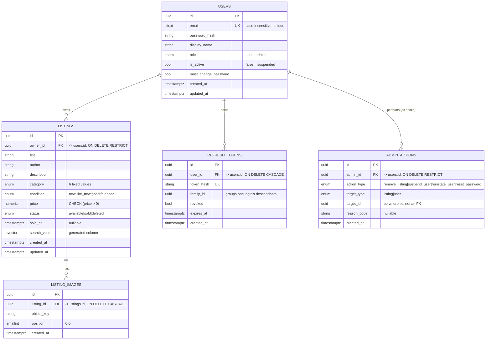

# Database

PostgreSQL 16. Five tables, one hand-written Alembic migration (`backend/alembic/versions/0001_initial_schema.py`). Written by hand rather than autogenerated so every enum name, cascade rule, and index is explicit and reviewable in one place — matching how the domain model is specified in the SRS.

## Entity-relationship diagram



## Tables

### `users`

| Column | Type | Notes |
|---|---|---|
| `id` | `uuid` PK | |
| `email` | `citext`, unique | Case-insensitive at the database level — `Foo@example.com` and `foo@example.com` collide on the unique constraint, not just on an application-level lowercase-before-compare convention. |
| `password_hash` | `text` | Argon2id, never a plaintext or reversibly-encrypted value. |
| `display_name` | `text` | |
| `role` | `role_enum` (`user`, `admin`) | No third role — see [`architecture.md`](architecture.md) for why "seller" isn't a role. |
| `is_active` | `bool`, default `true`, **indexed** | `false` = suspended. Indexed because every public listing-browse query joins on it. |
| `must_change_password` | `bool`, default `false` | Set by an admin-assisted password reset; cleared on the next successful password change. |
| `created_at` / `updated_at` | `timestamptz` | Server-default `now()`; `updated_at` also has `onupdate=now()`. |

### `listings`

| Column | Type | Notes |
|---|---|---|
| `id` | `uuid` PK | |
| `owner_id` | `uuid` FK → `users.id`, `ON DELETE RESTRICT`, indexed | Restrict, not cascade: a user should never be hard-deletable while owning listings — moot in practice since users are never hard-deleted at all, but the constraint documents intent. |
| `title`, `author`, `description` | `text` | |
| `category` | `listing_category_enum` | Fixed six values: `fiction`, `non_fiction`, `academic_textbook`, `children`, `comics_graphic_novels`, `other`. Adding a category is a migration, not a runtime-editable feature — see below. |
| `condition` | `listing_condition_enum` | `new`, `like_new`, `good`, `fair`, `poor`. |
| `price` | `numeric(10,2)`, `CHECK (price > 0)` | Never a float — exact decimal arithmetic for money. |
| `status` | `listing_status_enum`, default `available`, **indexed** | `available`, `sold`, `deleted`. |
| `sold_at` | `timestamptz`, nullable | Set when transitioning to `sold`. |
| `search_vector` | `tsvector`, **generated column** | `to_tsvector('english', coalesce(title,'') || ' ' || coalesce(author,''))`, computed and stored by Postgres itself on every insert/update. The application never writes to this column. |
| `created_at` / `updated_at` | `timestamptz` | Same convention as `users`. |

**Indexes:** `status` alone (DB-040, heavily filtered on its own); a composite `(status, category, condition)` (DB-041, the common filter combination); a GIN index on `search_vector` (DB-042); `owner_id`.

### `listing_images`

| Column | Type | Notes |
|---|---|---|
| `id` | `uuid` PK | |
| `listing_id` | `uuid` FK → `listings.id`, `ON DELETE CASCADE`, indexed | An image is meaningless without its listing — cascading here (unlike `owner_id` above) is the correct behavior, not just documented intent. |
| `object_key` | `text` | The S3/MinIO object key — server-generated (`listings/{listing_id}/{uuid4}.{ext}`), **never** derived from a user-supplied filename. |
| `position` | `smallint` | `0`–`5`. The 1–6 image count bound is enforced at the application layer (`ListingService.upload_images`), not a database constraint — a real "between 1 and 6 rows for this FK" constraint would need a trigger, which is more machinery than this bound is worth. |
| `created_at` | `timestamptz` | |

### `refresh_tokens`

| Column | Type | Notes |
|---|---|---|
| `id` | `uuid` PK | |
| `user_id` | `uuid` FK → `users.id`, `ON DELETE CASCADE`, indexed | A token has no meaning without its user. |
| `token_hash` | `text`, unique | HMAC-SHA256 of the opaque token — the plaintext token is never persisted. |
| `family_id` | `uuid`, indexed | Shared by every token descended from one login. Reusing a token that's already been rotated away from revokes every token sharing this value (theft/reuse detection). |
| `revoked` | `bool`, default `false` | |
| `expires_at` | `timestamptz` | 30 days from issuance by default. |
| `created_at` | `timestamptz` | |

### `admin_actions`

Append-only audit log — no update or delete path exists at either the repository or API layer.

| Column | Type | Notes |
|---|---|---|
| `id` | `uuid` PK | |
| `admin_id` | `uuid` FK → `users.id`, `ON DELETE RESTRICT`, indexed | An audit log must never lose its actor to a cascade delete. |
| `action_type` | `admin_action_type_enum` | `remove_listing`, `suspend_user`, `reinstate_user`, `reset_password`. |
| `target_type` | `admin_target_type_enum` | `listing` or `user`. |
| `target_id` | `uuid` | Polymorphic — **not** a foreign key. Two plain columns rather than a generic polymorphic-association pattern, since there are exactly two target types; a more generic scheme would be premature for a set this small and fixed. |
| `reason_code` | `text`, nullable | Required (enforced at the service layer) for `remove_listing` and `suspend_user`; null for `reinstate_user` and `reset_password`, which aren't punitive actions. |
| `created_at` | `timestamptz` | |

## Why no `categories` table

Six fixed values that change on the order of "never" don't warrant a separate table with its own CRUD endpoints and admin UI. A Postgres enum is the right-sized solution — adding a category is a one-line migration, not a feature. If categories genuinely need to be admin-editable at runtime someday, that's a clearly scoped follow-up, not a default to build speculatively now.

## Soft deletes

Listings are never row-deleted — `status` transitions to `deleted` instead. This preserves referential integrity for `listing_images` and `admin_actions` without cascade complexity, keeps the audit trail intact, and leaves room for a future "recently removed, undo" affordance without a schema change. User accounts are **never** hard-deleted in this version at all — suspension (`is_active=false`) is the only removal mechanism; true account erasure (e.g. for GDPR compliance) is an explicitly deferred, documented gap, not an oversight (see [SRS §11.4](../SRS-v2.1.0.md#114-soft-deletes)).

## Migrations

```bash
# apply
alembic upgrade head

# after changing a model, review + hand-edit the autogenerated diff
alembic revision --autogenerate -m "description"
```

There is exactly one migration in this repository today — the schema hasn't changed since Milestone 0. Every milestone since has re-run `alembic revision --autogenerate` against its own model changes and confirmed an **empty diff** wherever no schema change was actually needed (e.g. adding a `role` field to a Pydantic response schema touches no ORM model at all), which is itself a form of verification that the ORM models and the actual database schema haven't drifted apart.

## Related documents

- [`backend.md`](backend.md) — the repository layer that queries these tables
- [`architecture.md`](architecture.md) — why Postgres, why generated-column search
