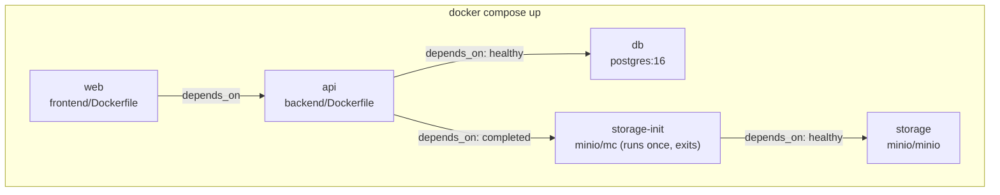

# Deployment

This document covers what's actually runnable today (local Docker Compose) and the production topology the SRS specifies for a future deployment. **Read the two sections as separate claims** — the first is implemented and verified; the second is a documented design, not yet built.

## What exists today: local Docker Compose

`docker-compose.yml` defines the entire stack:



- **`db`** — Postgres 16, a healthcheck (`pg_isready`), data persisted to a named volume.
- **`storage`** — MinIO (S3-compatible), with a healthcheck and the `MINIO_API_CORS_ALLOW_ORIGIN` environment variable set to the frontend's local origin (MinIO Community Edition doesn't implement the real S3 bucket-CORS API, so this server-level variable is its documented equivalent).
- **`storage-init`** — a one-shot `minio/mc` container that creates the bucket and sets it to public-read, then exits. This is what makes uploaded images fetchable by the browser with zero manual setup.
- **`api`** — built from `backend/Dockerfile`, bind-mounts `backend/app` and `backend/alembic` for live-reload, runs `uvicorn --reload`.
- **`web`** — built from `frontend/Dockerfile`, bind-mounts `frontend/src`, runs the Vite dev server.

```bash
docker compose up
docker compose exec api alembic upgrade head   # first run, and after any future migration
```

Rebuild (not just restart) after a dependency change:

```bash
docker compose build api   # after backend/pyproject.toml changes
docker compose build web   # after frontend/package.json changes
```

## CI (what runs on every PR)

`.github/workflows/ci.yml` runs four jobs on every push/PR to `main`: backend lint+type-check (Ruff, Ruff format, mypy strict), backend tests (pytest against a real containerized Postgres service, with a coverage gate), frontend type-check (`tsc --noEmit`), and frontend tests + production build (Vitest, then `npm run build`). There is currently **no separate build/push-Docker-image workflow** and **no automated deployment step** — CI verifies correctness, it does not deploy anything.

## Production topology (SRS §19 — documented design, not yet implemented)

The SRS specifies the following for a real deployment. None of this exists as actual infrastructure, Terraform/IaC, or a deploy script in this repository today — it's recorded here so the *decision* is made and justified in advance, per the SRS's own stated approach of resolving ambiguity before implementation rather than during it.

- **Reverse proxy** (nginx or a managed load balancer) terminates TLS in front of the API; the built frontend is served via the same proxy or a CDN.
- **Managed Postgres** (e.g. RDS, Neon, Supabase) — self-hosting Postgres for a project this size is operational burden without benefit. The managed provider's automated daily backups are considered sufficient; no custom backup tooling is specified.
- **Migrations as an explicit release step**, run once before new application code is deployed — never on application boot, so a failed migration can't leave multiple instances racing to migrate concurrently. A failed migration halts the deployment for manual review; automatic rollback tooling is explicitly not required at this scale.
- **Same registrable domain for frontend and API** (e.g. `app.example.com` / `api.example.com`) — this is a **hard requirement**, not a preference, because the refresh-token cookie's `SameSite=Strict` setting depends on it (see [`authentication.md`](authentication.md)). Deploying the two on unrelated domains is explicitly unsupported in this version.
- **Exact-origin CORS**, never a wildcard — already enforced at startup by the backend's own config validator, not only a deployment-time convention.
- **Exactly one running application instance** — the target scale for this whole system (see [`architecture.md`](architecture.md)). The in-memory rate limiter and any future in-memory refresh-token caching are explicitly single-instance-dependent and would need to move to a shared store before horizontal scaling.
- **No staging environment** — releases are verified via CI plus local Docker Compose parity, a deliberate scope decision for a small team, revisited only if team/user-base size grows enough to justify it.

## What is not yet built (honest gap statement)

- No committed Dockerfile variant or build step produces a production-optimized frontend image (an nginx-served static build, as opposed to the Vite dev server the current `frontend/Dockerfile` runs) — see [`../frontend/Dockerfile`](../frontend/Dockerfile), which is a dev-server image only.
- No infrastructure-as-code, no cloud provider configuration, no reverse-proxy configuration exists in this repository.
- No CD pipeline — CI validates a PR; nothing pushes an image or triggers a deploy.
- No load test has been run against the NFR-001 performance target (§18.3 in the SRS calls for a one-time, manually-run k6/Locust check before release — not yet performed).

These are Milestone 7 scope in the SRS's own plan and are tracked as such — see the [README's Roadmap](../README.md#roadmap).

## Related documents

- [`../docker-compose.yml`](../docker-compose.yml) — the actual local stack definition
- [`../.github/workflows/ci.yml`](../.github/workflows/ci.yml) — the actual CI pipeline
- [`authentication.md`](authentication.md) — why same-domain deployment is a hard requirement
- [`testing.md`](testing.md) — what's verified automatically vs. manually today
