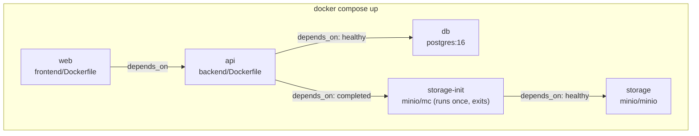

# Deployment

This document covers three things, in order: what's runnable locally today (Docker Compose), what CI verifies on every PR, and the exact production deployment process (Vercel + Render + managed Postgres + S3-compatible storage) — all three implemented and verified, not a future plan.

## What exists today: local Docker Compose

`docker-compose.yml` defines the entire stack:



- **`db`** — Postgres 16, a healthcheck (`pg_isready`), data persisted to a named volume.
- **`storage`** — MinIO (S3-compatible), with a healthcheck and the `MINIO_API_CORS_ALLOW_ORIGIN` environment variable set to the frontend's local origin (MinIO Community Edition doesn't implement the real S3 bucket-CORS API, so this server-level variable is its documented equivalent).
- **`storage-init`** — a one-shot `minio/mc` container that creates the bucket and sets it to public-read, then exits. This is what makes uploaded images fetchable by the browser with zero manual setup.
- **`api`** — built from `backend/Dockerfile`, bind-mounts `backend/app` and `backend/alembic` for live-reload, runs `uvicorn --reload` (docker-compose overrides the image's own `CMD`, though not its `ENTRYPOINT` — see below). Migrations apply automatically on every start; there is no manual step.
- **`web`** — built from `frontend/Dockerfile`, bind-mounts `frontend/src`, runs the Vite dev server. This image is a **local dev tool only** — production frontend hosting is Vercel (below), not this Dockerfile.

```bash
docker compose up
```

That's the whole local setup — [`backend/docker-entrypoint.sh`](../backend/docker-entrypoint.sh) runs `alembic upgrade head` before uvicorn starts, every time the `api` container boots, so there is no separate `docker compose exec api alembic upgrade head` step to remember (that command still works if you want to run it by hand for some other reason — see [`development.md`](development.md) — it just isn't required after `docker compose up` anymore).

Rebuild (not just restart) after a dependency change:

```bash
docker compose build api   # after backend/pyproject.toml changes
docker compose build web   # after frontend/package.json changes
```

## CI (what runs on every PR)

`.github/workflows/ci.yml` runs four jobs on every push/PR to `main`: backend lint+type-check (Ruff, Ruff format, mypy strict), backend tests (pytest against a real containerized Postgres service, with a coverage gate), frontend type-check (`tsc --noEmit`), and frontend tests + production build (Vitest, then `npm run build`). There is currently **no separate build/push-Docker-image workflow** and **no automated deployment step** — CI verifies correctness; deployment (below) is a manual, documented process.

## Production deployment

### Hard prerequisite: one registrable domain, split into two subdomains

The refresh-token cookie is `SameSite=Strict` (see [`authentication.md`](authentication.md)) — this is a deliberate security choice, not an oversight, and it depends on the frontend and API sharing one **registrable domain** (eTLD+1). `SameSite=Strict` cookies are never sent on a cross-*site* request, and Vercel's and Render's own default subdomains (`*.vercel.app`, `*.onrender.com`) are on **different** registrable domains from each other — deploying to those defaults as-is silently breaks `/auth/refresh`: login still works (the access token comes back in the response body, not the cookie), but the refresh cookie is never sent cross-site, so every session dies at the 15-minute access-token TTL with no way to renew it, and users are forced to re-login constantly.

**You must own a domain and configure it as two subdomains under the same registrable domain before deploying**, e.g.:

| Piece | Example subdomain |
|---|---|
| Frontend (Vercel) | `app.yourdomain.com` |
| API (Render) | `api.yourdomain.com` |

Both are configured as custom domains in each platform's dashboard (steps below) — set this up *before* the CORS/env-var steps that reference these URLs, so you're not redeploying to fix a placeholder later.

### Frontend: Vercel

1. Import the repository into Vercel and set the project's **Root Directory** to `frontend` (this is a monorepo — Vercel needs to know the frontend lives in a subfolder, not the repo root).
2. Vercel auto-detects Vite from [`frontend/vercel.json`](../frontend/vercel.json), which also declares the SPA fallback rewrite (every path serves `index.html`, required for React Router's client-side routes like `/listings/{id}` to survive a direct visit or refresh) and the explicit build/output/install commands.
3. Set one environment variable, **Production** scope: `VITE_API_BASE_URL=https://api.yourdomain.com`. This is a Vite build-time variable — Vite bakes it into the static bundle at build time, so **changing it requires a new deployment**, not just a restart.
4. Add the custom domain `app.yourdomain.com` in Vercel's Domains settings and point your DNS at Vercel per its instructions.
5. Deploy. Vercel runs `npm ci && npm run build` and serves `frontend/dist`.

### Backend: Render

**Why Render, not Railway or Fly.io**: this project's own architecture (see [`architecture.md`](architecture.md)) deliberately targets a single running instance with no orchestration layer — Render's plain "Web Service" model (one container, no cluster/edge-routing concepts to configure) matches that directly and needs the least new operational surface. It also builds directly from the existing `backend/Dockerfile` with no changes, bundles a managed Postgres in the same provider (simplest network path, one dashboard), and its Blueprint format ([`render.yaml`](../render.yaml)) captures the whole service as reviewable, committed config — Railway's usage-based billing model and Fly.io's edge-deployment/`fly.toml`-with-volumes model both bring capability this project's stated scale doesn't need.

1. Push [`render.yaml`](../render.yaml) (already in the repo root) — Render reads it automatically when you create a new Blueprint instance pointed at this repository. It provisions the `punah-pustak-api` web service (built from `backend/Dockerfile`) and a `punah-pustak-db` managed Postgres instance, and generates a random `JWT_SECRET` for you (`generateValue: true`).
2. In the Render dashboard, fill in the env vars the blueprint marks `sync: false` (it can't safely commit values for these):
   - `CORS_ALLOWED_ORIGINS` = `https://app.yourdomain.com` (exact origin, no trailing slash, no wildcard — the app refuses to start with a wildcard here regardless)
   - `STORAGE_ENDPOINT_URL`, `STORAGE_PUBLIC_URL`, `STORAGE_BUCKET`, `STORAGE_ACCESS_KEY`, `STORAGE_SECRET_KEY` — from whichever storage provider you chose (below)
3. Add the custom domain `api.yourdomain.com` in Render's dashboard and point your DNS at it.
4. Deploy. Migrations apply automatically, before the API starts serving — see "Automatic migrations on startup" below. There is no manual migration step, by design: **Render's free tier has no Shell access at all**, which made the previous "open a Shell and run `alembic upgrade head`" instruction not merely inconvenient but impossible to follow.
5. Confirm `GET https://api.yourdomain.com/api/v1/health` returns `{"status": "ok", "checks": {"database": "ok"}}`.

**Why `DATABASE_URL` just works, whatever Render hands you**: Render's `fromDatabase: connectionString` (and every other managed Postgres provider's connection string) is a bare `postgresql://...`/`postgres://...` URL with no SQLAlchemy driver qualifier. SQLAlchemy's default dialect for that bare scheme is **psycopg2** — not the psycopg3 this project actually installs (`psycopg[binary]`, see [`backend.md`](backend.md)) — so pasting a provider's connection string in unmodified used to crash the app at boot with `ModuleNotFoundError: No module named 'psycopg2'` (the exact failure hit on this project's first production deploy). `Settings._normalize_database_url_driver` (`app/core/config.py`) now rewrites the scheme to `postgresql+psycopg://` once, centrally, so any bare connection string works without operator intervention — verified against a real fresh Postgres instance, a real `alembic upgrade head` run, and both `linux/arm64` and `linux/amd64` builds (Render's infrastructure is `linux/amd64`; local Apple Silicon builds default to `arm64` and would not have caught an architecture-specific issue on their own).

`backend/Dockerfile`'s `CMD` binds to `${PORT:-8000}` (falling back to 8000 if unset) specifically because Render (like Railway) injects its own `PORT` and expects the process to listen on it — verified by running the built image standalone with `PORT=10000` and confirming it serves on that port, and separately confirming `docker stop` exits in well under a second (the `exec` in the `CMD` makes uvicorn PID 1, so it receives `SIGTERM` directly instead of a wrapping shell swallowing it).

### Automatic migrations on startup

`backend/docker-entrypoint.sh` is the image's `ENTRYPOINT`. Every time the container starts — a fresh Render deploy, a local `docker compose up`, a plain `docker run` — it runs `alembic upgrade head` first, and only `exec`s the actual application command (the Dockerfile's own `CMD`, or docker-compose's `command:` override with `--reload`) if that succeeds:

```mermaid
flowchart TD
    Start["Container starts"] --> Migrate["docker-entrypoint.sh:<br/>alembic upgrade head"]
    Migrate -->|"exit code 0"| Exec["exec \"$@\"<br/>(uvicorn, PID 1)"]
    Migrate -->|"non-zero"| Fail["FATAL logged, container exits non-zero —<br/>uvicorn never starts"]
```

If migrations fail, the container exits non-zero **before ever binding to a port**, so it never passes Render's health check — Render's zero-downtime deploy model then marks the deploy failed and leaves the previous (already-migrated, working) deploy running, exactly the outcome a failed migration should produce.

**This replaces the project's original policy** (formerly SRS DEPLOY-022: migrations "MUST run as an explicit release step, not on application boot") — that policy's actual concern was multiple instances independently racing to migrate concurrently, which cannot happen here: this project targets **exactly one running instance** (see [`architecture.md`](architecture.md)'s guiding scale constraint), so there is only ever one container running `alembic upgrade head` at a time, on any given deploy. Automating this step is safe specifically because of that constraint — it is not a general "migrate-on-boot is always fine" conclusion, and would need revisiting together with the rest of this document's single-instance assumptions if this project ever scaled horizontally.

Verified directly: built the image, ran `alembic upgrade head` against a genuinely empty, freshly-created Postgres database with no prior schema, and confirmed all 6 tables (`users`, `listings`, `listing_images`, `refresh_tokens`, `admin_actions`, `alembic_version`) existed and the health check passed — with zero manual steps. Separately confirmed the failure path: pointing `DATABASE_URL` at an unreachable host makes the container exit with status `1` and the application never starts.

### Database: PostgreSQL provider

Render's own managed Postgres (provisioned by `render.yaml` above) is the default recommendation — same provider as the API, simplest network path, one dashboard for both. Neon or Supabase are equally valid alternatives (both already named in this document's earlier drafts, both citext-compatible) if you'd rather decouple the database from the hosting provider, e.g. for Neon's branching or a separate free tier. Whichever you choose, **confirm `CREATE EXTENSION IF NOT EXISTS citext;` succeeds** before running migrations — the schema depends on it (`users.email`, [`database.md`](database.md)) and it's a commonly-available but not universal extension across every hosted Postgres.

### Storage: S3-compatible provider

The existing `StorageBackend`/`S3StorageBackend` code (see [`backend.md`](backend.md)) already works against any S3-compatible provider — no code change is needed to switch providers, only the `STORAGE_*` env vars.

| Provider | Notes |
|---|---|
| **AWS S3** | The provider this codebase's docs have always named as the production target. Create a bucket, a bucket policy allowing public `GetObject` (images must be browser-fetchable — see [`architecture.md`](architecture.md)'s storage flow), and a bucket-level CORS policy allowing your frontend's origin (the real S3 bucket-CORS API, unlike MinIO Community's `MINIO_API_CORS_ALLOW_ORIGIN` workaround). `STORAGE_ENDPOINT_URL=https://s3.<region>.amazonaws.com`, `STORAGE_PUBLIC_URL` = the bucket's public URL or a CDN in front of it. |
| **Cloudflare R2** | S3-compatible, no egress fees — a reasonable lower-cost alternative at this project's scale. Same env var shape; `STORAGE_ENDPOINT_URL` is the account-specific R2 endpoint, `STORAGE_PUBLIC_URL` is the bucket's public R2.dev URL or a custom domain. |

Whichever you choose, set the bucket to public-read for objects (matching what `storage-init` already does for local MinIO) — `StorageBackend.get_url` returns a direct object URL, never a presigned one, so the bucket itself must be readable.

### Order of operations, end to end

1. Register/configure the domain split (`app.` / `api.` subdomains).
2. Create the S3-compatible bucket and note its credentials.
3. Deploy the backend on Render via `render.yaml`, filling in `CORS_ALLOWED_ORIGINS` (the frontend subdomain decided in step 1) and the `STORAGE_*` values from step 2. Migrations apply automatically as part of this deploy — see "Automatic migrations on startup" above.
4. Confirm the health endpoint.
5. Deploy the frontend on Vercel with `VITE_API_BASE_URL` pointing at the API subdomain from step 1.
6. Smoke-test the deployed frontend against the deployed API: register, log in, create a listing, upload an image, refresh the page (confirms the cookie survives cross-subdomain, same-registrable-domain requests), log out.

## What is not yet built (honest gap statement)

- **No CD pipeline** — the steps above are manual (Vercel/Render both redeploy automatically on a push to the connected branch, but there's no scripted, one-command release process). Migrations themselves *are* automated (see "Automatic migrations on startup" above) — it's the surrounding release process (approvals, coordinated multi-service rollout) that remains manual.
- **No staging environment** — releases are verified via CI plus local Docker Compose parity, a deliberate scope decision for a small team, revisited only if team/user-base size grows enough to justify it.
- **No load test has been run** against the NFR-001 performance target (§18.3 in the SRS calls for a one-time, manually-run k6/Locust check before release — not yet performed).
- **Exactly one running application instance** remains the target scale for this whole system (see [`architecture.md`](architecture.md)) — the in-memory rate limiter and the row-locking added for the concurrency fixes in `backend.md` are correct at this scale but would need to move to a shared store/lock before horizontal scaling.

These are Milestone 7 scope in the SRS's own plan and are tracked as such — see the [README's Roadmap](../README.md#roadmap).

## Related documents

- [`../docker-compose.yml`](../docker-compose.yml) — the actual local stack definition
- [`../backend/docker-entrypoint.sh`](../backend/docker-entrypoint.sh) — runs migrations before the app starts, everywhere
- [`../render.yaml`](../render.yaml) — the backend's Render Blueprint
- [`../frontend/vercel.json`](../frontend/vercel.json) — the frontend's Vercel config
- [`../.github/workflows/ci.yml`](../.github/workflows/ci.yml) — the actual CI pipeline
- [`authentication.md`](authentication.md) — why same-registrable-domain deployment is a hard requirement
- [`testing.md`](testing.md) — what's verified automatically vs. manually today
