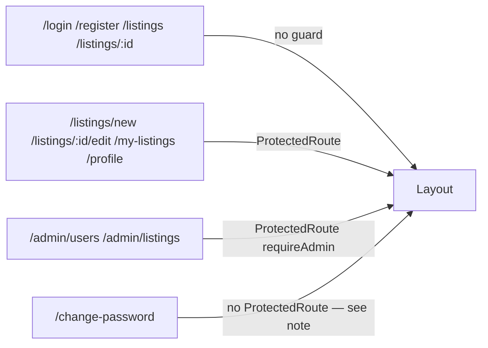

# Frontend

React 18 + TypeScript (strict) + Vite 8, consuming the backend's REST API exclusively — there is no server-side rendering and no framework-mode router (React Router is used in plain library/SPA mode).

```
frontend/src/
├── api/            generated types + typed fetch wrappers, one file per resource
├── auth/            AuthContext (session state) + ProtectedRoute (route guard)
├── components/       shared UI library + cross-page components
├── hooks/             TanStack Query hooks, one file per resource
├── lib/                small framework-agnostic helpers (no React/router imports)
├── pages/               one file per route
│   └── admin/             admin-only pages
├── App.tsx              the route tree
└── main.tsx               QueryClient + BrowserRouter + AuthProvider wiring
```

## API layer (`src/api/`)

- **`schema.ts`** — generated by `openapi-typescript` against the live backend's `/openapi.json` (`npm run generate-api-types`). **Never hand-edited.** This is what makes a backend schema change (e.g. adding a field) immediately visible as a frontend type error instead of a silent runtime mismatch.
- **`types.ts`** — convenience re-exports from `schema.ts`'s `components["schemas"]` namespace, so the rest of the app writes `ListingPublic` instead of `components["schemas"]["ListingPublic"]` everywhere.
- **`errors.ts`** — `ApiError`, thrown by every failed request, carrying the parsed `{code, message, fields}` envelope so callers can branch on `error.code` (e.g. `PASSWORD_CHANGE_REQUIRED`) or map `error.fields` back onto form inputs.
- **`tokenStore.ts`** — the in-memory access-token store (a plain module-level variable, not React state) — see [`authentication.md`](authentication.md) for why it's kept separate from `AuthContext`.
- **`client.ts`** — `apiFetch()`, the one function every API call in the app goes through. Attaches the `Authorization` header if a token is present, always sends `credentials: "include"` (for the refresh cookie), retries once on a `401` via a shared in-flight refresh lock (see below), and fires global handlers for session-expired and forced-password-change conditions.
- **`auth.ts` / `users.ts` / `listings.ts` / `admin.ts`** — one thin wrapper function per backend endpoint, each calling `apiFetch` with the right path/method/body. No component ever calls `apiFetch` directly.

### The shared in-flight refresh lock

If several TanStack Query hooks fire near-simultaneously right as the access token expires (a routine case — most pages fire more than one query on mount), a naive "catch 401, call refresh" implementation would call `POST /auth/refresh` multiple times concurrently. Because refresh tokens rotate on every use and a *reused* token is treated as evidence of theft (see [`authentication.md`](authentication.md)), that naive implementation would false-positive its own legitimate user into a forced logout. `client.ts` fixes this with a single module-level `Promise` that every concurrent 401 awaits instead of starting its own refresh call.

## Auth state (`src/auth/`)

`AuthContext` holds one of four states: `loading` (session restore in progress), `unauthenticated`, `password-change-required`, or `authenticated` (carrying the current `UserPublic`, including `role` — see below). On mount, it calls `POST /auth/refresh` once to try to re-establish a session from the `HttpOnly` refresh cookie (the in-memory access token never survives a page reload by design).

`ProtectedRoute` is a client-side route guard: unauthenticated → redirect to `/login`; `password-change-required` → redirect to `/change-password`; `requireAdmin` and the user isn't an admin → redirect home. This is a UX nicety only — the server re-checks authorization on every request regardless of what this component decides to render.

A **403 `PASSWORD_CHANGE_REQUIRED`** from *any* authenticated call (not only the one right after login) triggers the same redirect — this covers the case where an admin resets a still-logged-in user's password mid-session.

## Server state: TanStack Query (`src/hooks/`)

Every server-state read or write in the app goes through a TanStack Query hook in `useListings.ts`, `useAdmin.ts`, or `useProfile.ts` — never a raw `fetch` or an `api/*.ts` call from inside a component, and there is no Redux/Zustand store duplicating server data anywhere. Mutation hooks invalidate the relevant query keys on success (e.g. creating a listing invalidates the browse list, "my listings", and the status summary in one call).

One deliberate pattern worth calling out: hooks whose target doesn't exist yet at render time (e.g. `useUploadListingImages`) take their id as a **call-time argument** to `mutateAsync`, not a hook parameter — a hook parameter would close over whatever the id was at the *last render*, which is empty on `CreateListingPage` (the listing doesn't exist until the create mutation resolves, moments before the image-upload mutation needs to fire in the same handler).

## Component library (`src/components/`)

`Button`, `Input`, `Select`, `Modal`, `Card`, `Badge` — the shared, reused-everywhere primitives. Every form input associates its label via `htmlFor`/`id` (never placeholder-as-label) and links its error message via `aria-describedby` plus `role="alert"` (never color alone). `Modal` implements a manual focus trap (captures the previously-focused element on open, cycles `Tab`/`Shift+Tab` between the first and last focusable descendants, restores focus on close) and closes on `Escape`.

Cross-page components layered on top of those primitives: `QueryState` (the one place loading/error/empty states are rendered, so every data-dependent view handles all three explicitly instead of each page reinventing a spinner), `ListingCard`, `Pagination`, `ListingForm` (shared by create and edit), `ImageUploadField`, `PasswordChangeForm` (shared by the self-service profile page and the forced-change page), `Layout` (the persistent nav + `<Outlet/>`), and `AdminNav` (the Users/Listings sub-nav for the admin section).

## Pages (`src/pages/`)

One file per route, matching the resource model: `BrowsePage`, `ListingDetailPage`, `CreateListingPage`, `EditListingPage`, `MyListingsPage`, `ProfilePage`, `LoginPage`, `RegisterPage`, `ChangePasswordPage`, and `admin/AdminUsersPage` / `admin/AdminListingsPage`. Every confirmation-required destructive action (mark sold, delete, admin suspend/reset-password/remove-listing) is behind a `Modal`, never a single click.

## Routing (`App.tsx`)



`/change-password` is deliberately **not** wrapped in `ProtectedRoute`: that guard itself redirects a `password-change-required` session to this exact route, which would loop. `AuthContext`'s own global handler already navigates here directly when the triggering 403 arrives.

## Styling

Tailwind CSS v4, via the `@tailwindcss/vite` plugin — no separate `postcss.config.js`/`tailwind.config.js` file is needed for this version. No ad hoc inline styles except where a value is genuinely dynamic and Tailwind can't express it statically.

## Type generation workflow

```bash
# with the backend running locally on :8000
npm run generate-api-types
```

Regenerates `src/api/schema.ts` from the live OpenAPI schema. Run this after any backend schema change; `tsc --noEmit` will then surface every place the frontend needs to catch up, as compile errors rather than a runtime surprise.

## Related documents

- [`architecture.md`](architecture.md) — how the frontend fits into the overall system
- [`authentication.md`](authentication.md) — the token lifecycle from the frontend's side
- [`testing.md`](testing.md) — how the frontend is tested
