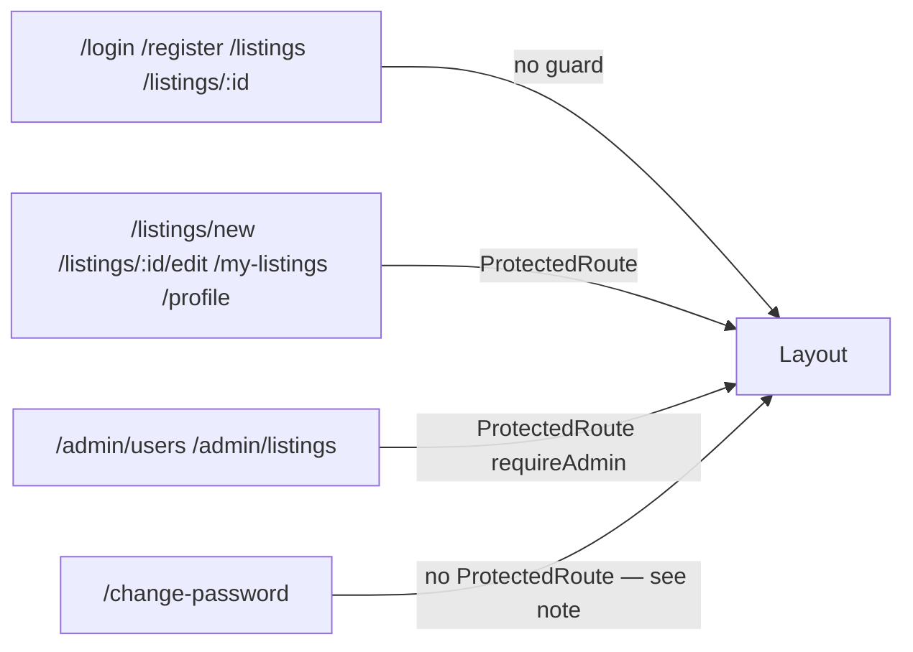

# Frontend

React 18 + TypeScript (strict) + Vite 8, consuming the backend's REST API exclusively — there is no server-side rendering and no framework-mode router (React Router is used in plain library/SPA mode).

```
frontend/src/
├── api/            generated types + typed fetch wrappers, one file per resource
├── auth/            AuthContext (session state) + ProtectedRoute (route guard)
├── components/       shared UI library + cross-page components
├── hooks/             TanStack Query hooks, one file per resource
├── lib/                small framework-agnostic helpers (no React/router imports)
├── pages/               one file per route
│   └── admin/             admin-only pages
├── App.tsx              the route tree
└── main.tsx               QueryClient + BrowserRouter + AuthProvider wiring
```

## API layer (`src/api/`)

- **`schema.ts`** — generated by `openapi-typescript` against the live backend's `/openapi.json` (`npm run generate-api-types`). **Never hand-edited.** This is what makes a backend schema change (e.g. adding a field) immediately visible as a frontend type error instead of a silent runtime mismatch.
- **`types.ts`** — convenience re-exports from `schema.ts`'s `components["schemas"]` namespace, so the rest of the app writes `ListingPublic` instead of `components["schemas"]["ListingPublic"]` everywhere.
- **`errors.ts`** — `ApiError`, thrown by every failed request, carrying the parsed `{code, message, fields}` envelope so callers can branch on `error.code` (e.g. `PASSWORD_CHANGE_REQUIRED`) or map `error.fields` back onto form inputs.
- **`tokenStore.ts`** — the in-memory access-token store (a plain module-level variable, not React state) — see [`authentication.md`](authentication.md) for why it's kept separate from `AuthContext`.
- **`client.ts`** — `apiFetch()`, the one function every API call in the app goes through. Attaches the `Authorization` header if a token is present, always sends `credentials: "include"` (for the refresh cookie), retries once on a `401` via a shared in-flight refresh lock (see below), and fires global handlers for session-expired and forced-password-change conditions.
- **`auth.ts` / `users.ts` / `listings.ts` / `admin.ts`** — one thin wrapper function per backend endpoint, each calling `apiFetch` with the right path/method/body. No component ever calls `apiFetch` directly.

### The shared in-flight refresh lock

If several TanStack Query hooks fire near-simultaneously right as the access token expires (a routine case — most pages fire more than one query on mount), a naive "catch 401, call refresh" implementation would call `POST /auth/refresh` multiple times concurrently. Because refresh tokens rotate on every use and a *reused* token is treated as evidence of theft (see [`authentication.md`](authentication.md)), that naive implementation would false-positive its own legitimate user into a forced logout. `client.ts` fixes this with a single module-level `Promise` that every concurrent 401 awaits instead of starting its own refresh call.

## Auth state (`src/auth/`)

`AuthContext` holds one of four states: `loading` (session restore in progress), `unauthenticated`, `password-change-required`, or `authenticated` (carrying the current `UserPublic`, including `role` — see below). On mount, it calls `POST /auth/refresh` once to try to re-establish a session from the `HttpOnly` refresh cookie (the in-memory access token never survives a page reload by design).

`ProtectedRoute` is a client-side route guard: unauthenticated → redirect to `/login`; `password-change-required` → redirect to `/change-password`; `requireAdmin` and the user isn't an admin → redirect home. This is a UX nicety only — the server re-checks authorization on every request regardless of what this component decides to render.

A **403 `PASSWORD_CHANGE_REQUIRED`** from *any* authenticated call (not only the one right after login) triggers the same redirect — this covers the case where an admin resets a still-logged-in user's password mid-session.

## Server state: TanStack Query (`src/hooks/`)

Every server-state read or write in the app goes through a TanStack Query hook in `useListings.ts`, `useAdmin.ts`, or `useProfile.ts` — never a raw `fetch` or an `api/*.ts` call from inside a component, and there is no Redux/Zustand store duplicating server data anywhere. Mutation hooks invalidate the relevant query keys on success (e.g. creating a listing invalidates the browse list, "my listings", and the status summary in one call).

One deliberate pattern worth calling out: hooks whose target doesn't exist yet at render time (e.g. `useUploadListingImages`) take their id as a **call-time argument** to `mutateAsync`, not a hook parameter — a hook parameter would close over whatever the id was at the *last render*, which is empty on `CreateListingPage` (the listing doesn't exist until the create mutation resolves, moments before the image-upload mutation needs to fire in the same handler).

## Component library (`src/components/`)

The visual direction is "Copy Record": every listing is one physical second-hand copy being examined. A seller's photos are evidence, the condition grade is a record, and the seller's description is the human voice. Components are built around that, not around product cards.

**Primitives**: `Button` (plus `buttonClasses()`, so a navigating `<Link>` can look like a button while staying a link), `Input`, `Select`, `Badge`, `Skeleton`, and `Modal`.

- Every form input associates its label via `htmlFor`/`id` (never placeholder-as-label) and links its error message via `aria-describedby` plus `role="alert"` (never colour alone). Input and select boundaries use `rule-strong`, which clears WCAG 1.4.11's 3:1 against the ground.
- `Button` variants: `primary` (ballpoint fill), `secondary` (outlined in `rule-strong`), `danger` (used only inside a destructive confirmation), `ghost`. 2px corners, no shadows, no press animation.
- `Badge` is a status written as a label, not a pill: no background, and a leading mark whose *shape* carries the state (filled disc for available/active, hollow ring for sold, a cross in `danger` for removed/suspended). The mark is `aria-hidden`; the text is what is read.
- `Modal` implements a manual focus trap (captures the previously focused element on open, cycles `Tab`/`Shift+Tab` between the first and last focusable descendants, restores focus on close) and closes on `Escape`. Variants: `dialog` (centred confirmation), `sheet` (anchored to the bottom edge on phones; Browse's filters), and `lightbox` (the full viewport in ink, used for a listing's photos, with the title as a mono caption line and a text Close button).
- `Skeleton` blocks sit on the photo field colour; `ListingCardSkeleton`/`ListingGridSkeleton`/`ListingDetailSkeleton` mirror the real layouts so swapping in content causes no layout shift.

**Listing records**: the visual centre of the app.

- `PhotoFrame`: the evidence field every seller photo sits on. The photo is scaled to fit inside a ~6% inset on the `field` colour, **never cropped**, at its true proportions, with no shadow and at most 2px rounding. Variants: `grid` (square; every listing grid), `thumb` (square; ledger, admin and Home list rows) and `stage` (the detail page's main photo, whose field takes the photo's own shape clamped between 4:3 and 3:4, so a 3:1 page-block shot isn't a thin band in a large empty square). A photo stays `invisible` until it has loaded (the field is already sized, so nothing moves), and one that fails to load falls back to `NoCoverPlaceholder`. The field darkens slightly when its parent link (`group`) is hovered or focused; that is the only hover state a listing has. `inactive` desaturates a copy that is no longer for sale (owner/admin views only).
- `NoCoverPlaceholder`: the no-photo state as **missing evidence**, not an alternative cover. The same field colour with a dashed inner rule, the label "No photo yet", and the listing's title and author in secondary ink, deliberately quieter than any real photo. Title and author are CSS generated content inside an `aria-hidden` box, because every caller already renders them as real text. Sizes: `grid`, `thumb` (dashed rule only), and `stage` (a compact 3:2 notice on the detail page so the absence of a photo is never the largest object on the page).
- `ConditionMeter`: a condition grade as a five-step scale, e.g. `●●●○○ Good`, using `CONDITION_SCORE` from `lib/listingLabels.ts` (new 5 … poor 1). Filled versus hollow marks plus the word, both in ink, so it reads without colour; the marks are `aria-hidden` and a visually hidden "Condition:" prefixes the word. `sm` everywhere, `lg` on the detail page. Browse's condition filter is the same meter.
- `ListingCard`: a listing as a catalogue record, not a card: no box, no shadow, no lift. In order: `PhotoFrame` (grid), title (two lines max) and author (one line) in a block that always reserves two title lines, a ruled line with price and `ConditionMeter`, "from <seller>" (with "N photos" in mono when there is more than one), and, from 1280px and only when the description is substantive (`isSubstantiveNote`, 28+ characters), a two-line excerpt of the seller's note in italic ballpoint with a 2px ballpoint left rule. Hover darkens the field and underlines the title; nothing moves. Props: `showStatus` (owner/admin only; public browse never shows status, FR-026), `showSeller` (off in "More from <seller>"), `showNote`, `density`. Grids share their column layout through `lib/layout.ts` (`LISTING_GRID_CLASSES`, `HOME_GRID_CLASSES`, `RAIL_CLASSES`, and `PAGE_CLASSES` for the page measure).

**Page-level and cross-page components**:

- `Layout`: the persistent header, `<Outlet/>` and `Footer`. The header is the wordmark followed directly by left-aligned navigation (Browse, List a copy, and, signed in, My listings, Profile, Admin for admins), with the account controls at the far right (Log in + Register, or Log out), over a single ink rule. The current page is marked by a 3px ink bar sitting on that rule. 64px tall from `md`, 56px on phones, where the links fold into a `#mobile-nav` panel opened by a "Menu" button (`aria-label` "Open menu"/"Close menu"). On `/admin/*` the Admin item stays current and the footer is omitted.
- `Logo`: a pure wordmark, "Punah-Pustak" in heavy Schibsted Grotesk with the hyphen in ballpoint. No icon.
- `Footer`: one ruled line: wordmark, what the name means and that exchange happens off-site, and a few links that follow the session.
- `AuthShell`: the frame for login, registration and the forced password change: one 400px column, left-aligned to the site grid, with no imagery or panel.
- `PageHeader`: title, one line of supporting copy, and the page's actions; used by account and admin pages.
- `EmptyState`: an empty result stated in words under an ink rule, with the one way forward when there is one. (Its `icon` prop is accepted for compatibility but not drawn.)
- `QueryState`: the one place loading/error/empty states are rendered, so every data-dependent view handles all three explicitly.
- `Pagination`: a ruled line with "Page n of m" in mono and Previous/Next.
- `AdminNav` (the Users/Listings tabs) and `AdminControls`: `adminActionClasses()` makes row actions quiet underlined ballpoint text (the destructive colour belongs to the confirmation dialog, not the trigger), and `SegmentedFilter` is a row of text toggles (`aria-pressed`). Admin tables switch to stacked records below the `lg` breakpoint (1024px) via `useMediaQuery`, so only one layout is ever in the DOM.
- `ListingForm` (shared by create and edit), `ImageUploadField` (previews each chosen file uncropped on the square field) and `PasswordChangeForm` (shared by the profile page and the forced-change page).

## Pages (`src/pages/`)

One file per route, matching the resource model. Every confirmation-required destructive action (mark sold, delete, admin suspend/reset-password/remove-listing) is behind a `Modal`, never a single click.

- `HomePage`: no hero. A one-line statement, the search field as the main object, and a mono line with the real copy count. "Just in" (the 10 newest copies, 6 on phones) is the visual opening. Below it, three ruled lists that are each a real browse query (Under $5 → `max_price=4.99`; Barely read → `condition=like_new`; Textbooks → `category=academic_textbook`), each with an "All N" link that opens Browse with exactly that query; a list hides itself when its query is empty or fails (the "Just in" section reports errors). Then the categories as a plain text index and one "List a copy" band under a ballpoint rule.
- `BrowsePage`: search plus category/condition/price filtering (FR-001..004), 24 per page. From 1024px the filters are a sticky 240px column (category radios, the condition scale, min/max price and the presets Under $5 / $5-15 / $15+); below that, the search field and a "Filters · n" button stay pinned to the top and the filters open in the `sheet` modal. Both render the same `FilterFields`. Active filters are removable text labels with ×. The URL seeds state (`search`, `category`, `condition`, `min_price`, `max_price`), which is how Home's links arrive; filter changes don't write back to it.
- `ListingDetailPage`: from 768px, the photos on the left (the `stage` frame, the full set as a contact strip at true proportions, and a lightbox with Previous/Next and arrow keys) and a sticky record column on the right; on phones, a horizontal, snapping strip of square frames with a "1 / n" counter, then the record. The record, in order: title (smaller over 80 characters), author, price, `ConditionMeter` with the grade's definition, the seller's note (ballpoint italic under a left rule), "Passed on by" with member-since and active-listing count, then either the owner's actions or the honest line "Punah-Pustak doesn't connect buyers and sellers yet." (there is no contact or checkout API, so there is no Contact or Buy button), and a mono record line ("Listed 3 Oct 2026 · Academic textbook · 4 photos"). Then "More from <seller>" as a rail.
- `MyListingsPage`: the seller's ledger: status tabs with counts (All/Available/Sold/Removed), then one ruled row per copy (56px photo, title/author, price, condition, status, date, text actions View and Edit). Rows stack into short records below 1024px. Mark as sold and Delete stay on the detail page behind their confirmations.
- `ProfilePage`: three ruled sections (Account, Your copies as a numeric summary, Password), no avatar.
- `LoginPage`, `RegisterPage`, `ChangePasswordPage`: inside `AuthShell`, each with one factual line about what the account is for.
- `CreateListingPage`, `EditListingPage`: `ListingForm` in a left-aligned column.
- `admin/AdminUsersPage`, `admin/AdminListingsPage`: dense tables with sticky headers, compact rows, mono IDs and dates, text status with a shape mark and quiet text actions; stacked records below 1024px.

## Routing (`App.tsx`)


```mermaid
flowchart LR
    Public["/login /register /listings /listings/:id"] -->|no guard| Layout
    Protected["/listings/new /listings/:id/edit /my-listings /profile"] -->|ProtectedRoute| Layout
    Admin["/admin/users /admin/listings"] -->|ProtectedRoute requireAdmin| Layout
    ChangePw["/change-password"] -->|"no ProtectedRoute — see note"| Layout
```

`/change-password` is deliberately **not** wrapped in `ProtectedRoute`: that guard itself redirects a `password-change-required` session to this exact route, which would loop. `AuthContext`'s own global handler already navigates here directly when the triggering 403 arrives.

## Styling

Tailwind CSS v4, via the `@tailwindcss/vite` plugin; no separate `postcss.config.js`/`tailwind.config.js` file is needed for this version. No ad hoc inline styles except where a value is genuinely dynamic (the detail stage's aspect ratio).

**Colour roles.** Tokens live in `src/index.css` (`@theme`) and each has exactly one job:

| Token | Value | Role |
|---|---|---|
| `ground` | `#F5F3EF` | the page |
| `field` / `field-hover` | `#E4E0D8` / `#D9D4CA` | the surface photographic evidence sits on (photo frames, no-photo tiles, skeletons); `field-hover` is a listing's only hover state |
| `ink` | `#1B1A18` | primary text, prices, condition marks |
| `ink-2` | `#5C5852` | secondary text |
| `rule` | `#D2CDC4` | hairline separators that carry no meaning on their own |
| `rule-strong` | `#8C877E` | structural lines and every input/control boundary (3:1, WCAG 1.4.11) |
| `ballpoint` / `ballpoint-deep` | `#2438B8` / `#1B2C94` | the only accent: links, primary actions, focus, and human marks (the seller's note) |
| `danger` | `#A8261B` | destructive actions and errors only |

There are no category colours, gradients, textures or shadows. Condition is never encoded by colour. Section structure comes from full-width ink rules and hairlines rather than boxes.

**Typography.** Schibsted Grotesk for the whole interface (headings, listing titles, navigation, controls); IBM Plex Mono only for small record metadata (dates, photo counts, query descriptions, admin IDs, the temporary password). No serif anywhere. The scale is 13 / 15 / 17 / 22 / 30 / 44px (`text-13` … `text-44` in `@theme`). The `.tnum` utility sets tabular, lining figures where numbers sit in columns (ledgers, tables, counts); display prices use the default figures.

**Motion.** Almost none: 140-180ms state changes (dialog 160ms, sheet 180ms, menu 140ms), 150ms colour changes on hover, a 160ms opacity fade when a photo appears, and the skeleton shimmer. Nothing arrives on scroll, staggers, floats or lifts. Everything is gated behind `prefers-reduced-motion: no-preference` (the shimmer turns itself off with `motion-reduce:`), and text-bearing elements only ever animate `transform`, never opacity.

**Focus.** A 2px ballpoint outline with a 2px offset on `:focus-visible`, set in `@layer base` so a component's own focus utilities can refine it.

`src/test/contrast.test.ts` reads the tokens out of `index.css` and guards them: `ink`, `ink-2`, `ballpoint` and `danger` at 4.5:1 on `ground`, `field`, `field-hover` and white; white text at 4.5:1 on `ballpoint`, `ballpoint-deep` and `danger`; and `rule-strong` at 3:1 against the ground and white.

## Type generation workflow

```bash
# with the backend running locally on :8000
npm run generate-api-types
```

Regenerates `src/api/schema.ts` from the live OpenAPI schema. Run this after any backend schema change; `tsc --noEmit` will then surface every place the frontend needs to catch up, as compile errors rather than a runtime surprise.

## Related documents

- [`architecture.md`](architecture.md) — how the frontend fits into the overall system
- [`authentication.md`](authentication.md) — the token lifecycle from the frontend's side
- [`testing.md`](testing.md) — how the frontend is tested
